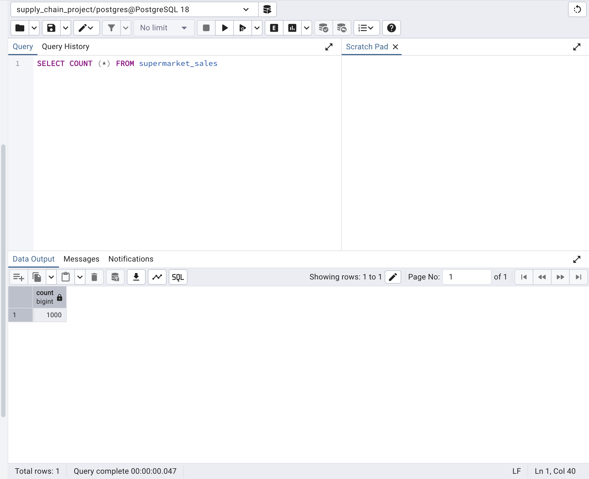
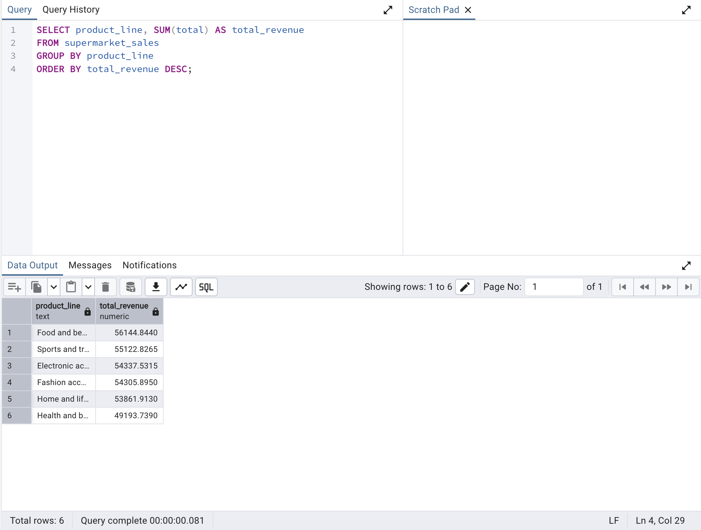
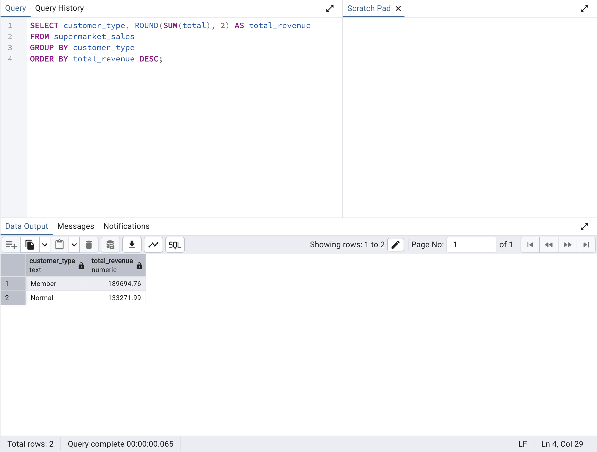

# Retail Supply Chain Performance Analysis (SQL Project)

## 📌 Business Objective
The objective of this project is to analyze retail sales data to identify high-performing and low-performing product lines, understand customer purchasing behavior, and provide data-driven recommendations to support inventory planning and operational decision-making.

## 📊 Project Overview
This project demonstrates analytical skills in supply chain operations using SQL. It focuses on inventory patterns, demand trends, and operational insights from a transactional dataset.
Although the dataset is based on a retail example, the analytical methods used are directly applicable to industries such as mining, manufacturing, and logistics, where data-driven decision-making in inventory, procurement, and operations is critical. 
The dataset contains 1,000 transaction records across multiple branches and customer types.

### Data Import Validation

Below shows successful validation of data import into PostgreSQL (1000 rows loaded):

## 🔍 Key Insights

### 1️⃣ Top Revenue-Generating Product Line

**Result Visualization:**

 

This analysis identifies the product category that generates the highest total revenue. High-performing product lines indicate strong customer demand and should be prioritized for inventory allocation to prevent stock shortages and maximize sales performance.

### 2️⃣ Revenue by Customer Type

**Result Visualization:**

This result shows that Member customers generate higher total revenue compared to Normal customers. This insight suggests that loyalty programs and membership incentives are effective in increasing customer spending and should be further optimized to improve long-term revenue performance.

## 📌 Business Recommendations
Based on the analysis results, the following actions are recommended:

### 1️⃣ Prioritize High-Revenue Product Lines
Food and Beverage products should receive higher inventory allocation and more frequent restocking cycles. This will reduce the risk of stockouts and help maximize revenue from consistently high-demand items.

### 2️⃣ Strengthen Membership Programs
Since Member customers generate higher revenue, targeted promotions such as exclusive discounts and loyalty rewards should be expanded to increase customer retention and repeat purchases.
### 3️⃣ Improve Demand Forecasting Strategy
Sales patterns across product lines and customer segments should be incorporated into demand forecasting models to improve procurement planning and reduce excess inventory costs.

## 🛠 Tools & Skills Used

- PostgreSQL — Relational database for structured data storage
- SQL — Data aggregation, filtering, grouping, and sorting
- pgAdmin 4 — Query execution and database management
- GitHub — Project documentation
- Business Data Analysis — Translating raw data into actionable insights

## 📁 Project Structure

/sql  
- SQL queries used for analysis  

/screenshots  
- Query result evidence and data validation screenshots  

README.md  
- Project documentation, insights, and business recommendations  

## 📌 Project Summary

This project demonstrates an end-to-end SQL data analysis workflow including data validation, performance analysis, aggregation reporting, and business recommendation development for retail supply chain optimization. Although this project uses a retail dataset, the analytical approach is directly transferable to mining and other asset-intensive industries. Similar SQL techniques are used to analyse spare parts usage, consumables demand, and inventory turnover in mining operations, where stock availability and lead time variability directly impact production continuity.
